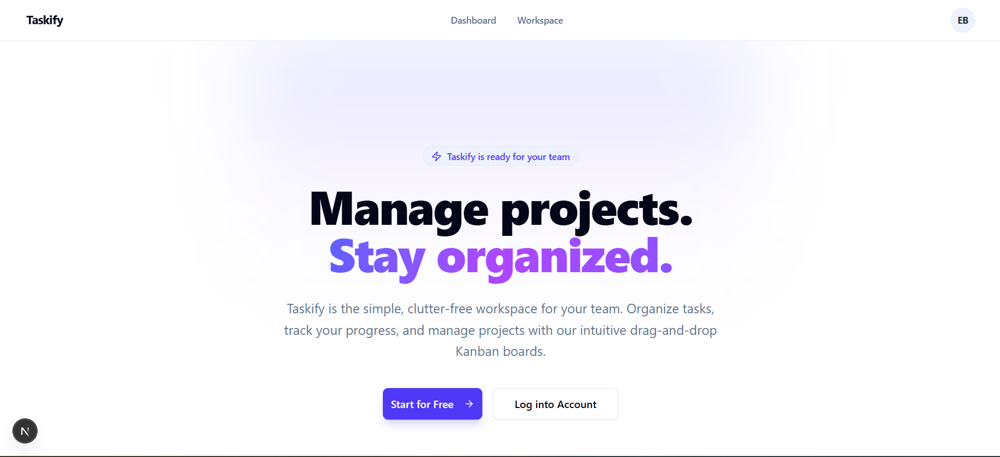
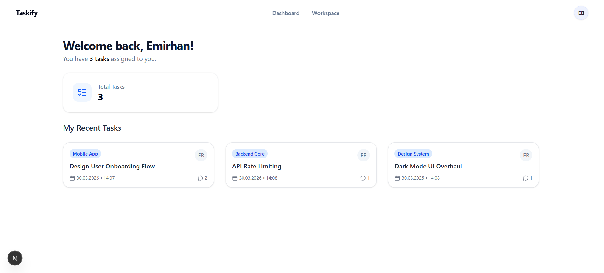
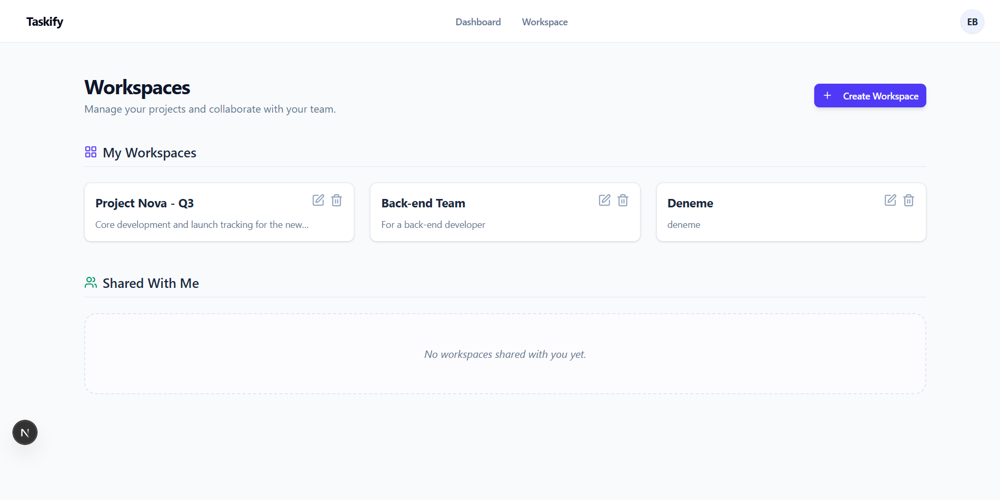
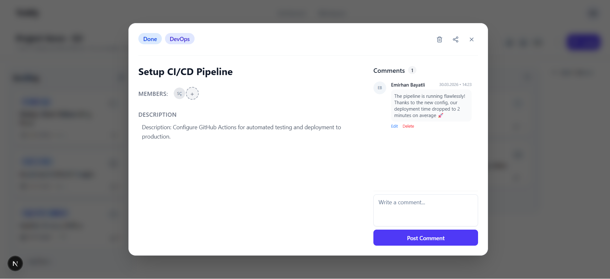
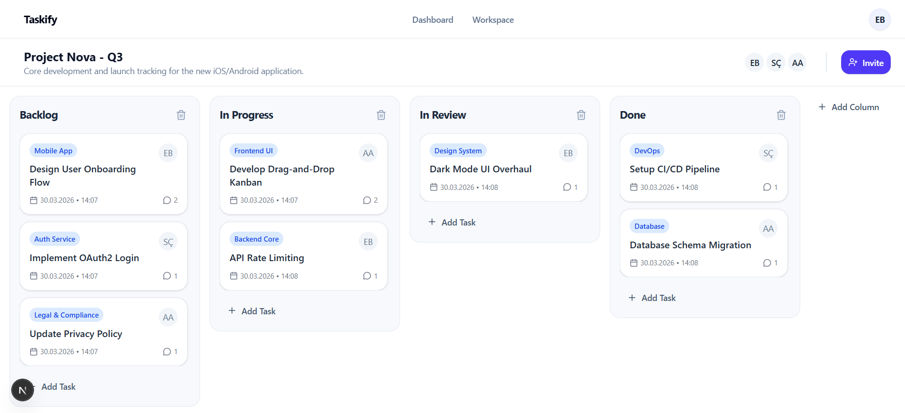
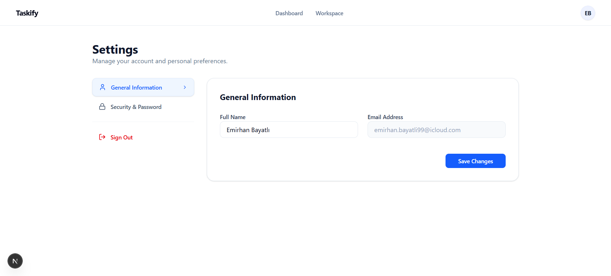
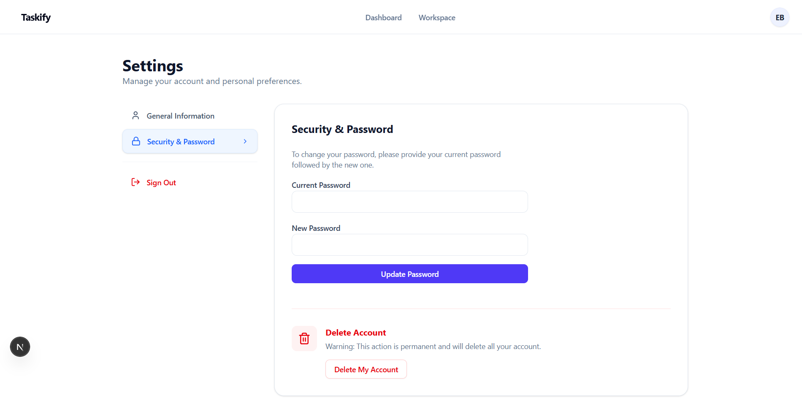

<div align="center">

# 🚀 Taskify

**Next-Generation Agile Task Management SaaS**

Taskify is a high-performance, real-time platform designed to streamline project organization through intuitive Kanban boards and secure team collaboration.

[](https://nextjs.org/)
[](https://react.dev/)
[](https://firebase.google.com/)
[](https://tailwindcss.com/)

## </div>

## 📸 Preview

### Desktop Experience

<table border="0">
  <tr>
    <td>
      <p align="center"><b>Home Page</b></p>
      
    </td>
    <td>
      <p align="center"><b>Dashboard</b></p>
      
    </td>
  </tr>
  <tr>
    <td>
      <p align="center"><b>Workspace</b></p>
      
    </td>
    <td>
      <p align="center"><b>Task Management</b></p>
      
    </td>
  </tr>
</table>

### Workspace & Settings

<p align="center">
  
  
  
</p>

---

## 📖 Overview

Taskify is a modern SaaS application that transforms complex project management into a simple, visual experience. Built with **React 19** and **Next.js 16**, it offers a seamless interface where teams can collaborate in real-time without the clutter of traditional tools.

---

## ✨ Core Features

### 📋 Visual Workflow (Kanban)

- **Dynamic Boards:** Manage tasks with a fluid drag-and-drop interface powered by `@dnd-kit`.
- **Status Tracking:** Easily move tasks between "To Do", "In Progress", and "Done" columns.

### 🔒 Enterprise-Grade Security

- **Workspace Isolation:** Each project exists in its own secure environment, preventing data overlap.
- **Advanced Auth:** Secure login, registration, and password recovery via **Firebase Authentication**.

### 🤝 Seamless Collaboration

- **Member Management:** Invite team members via email using **Resend API** and assign them to specific tasks.
- **Interactive Comments:** Keep the conversation tied to the work with task-specific comment threads.

---

## 🛠️ Technical Excellence

### Tech Stack

| Layer        | Technologies                                  |
| :----------- | :-------------------------------------------- |
| **Frontend** | Next.js 16 (App Router), React 19, TypeScript |
| **Styling**  | Tailwind CSS v4, Shadcn UI, Radix UI          |
| **Backend**  | Firebase Auth, Cloud Firestore, Resend API    |
| **Logic**    | @dnd-kit, React Hook Form, Zod                |

---

## ⚙️ Getting Started

### 1. Prerequisites

- Node.js v18.17+
- Firebase Project Credentials
- Resend API Key

### 2. Installation & Setup

```bash
# Clone the repository
git clone [https://github.com/your-emirhanbayatli/taskify.git](https://github.com/your-emirhanbayatli/taskify.git)

# Install dependencies
npm install

# Configure environment variables (.env)
NEXT_PUBLIC_FIREBASE_API_KEY=your_key
NEXT_PUBLIC_FIREBASE_PROJECT_ID=your_id
RESEND_API_KEY=your_resend_key
```
### 3. Launch
```bash
npm run dev
```

## 🎯 Vision & Roadmap

Taskify aims to deliver a fast, intuitive, and scalable task management experience for both individuals and growing teams. The focus is simplicity, performance, and real-time collaboration.

## 🤝 Contributing

Give it a ⭐ on GitHub and feel free to contribute!
